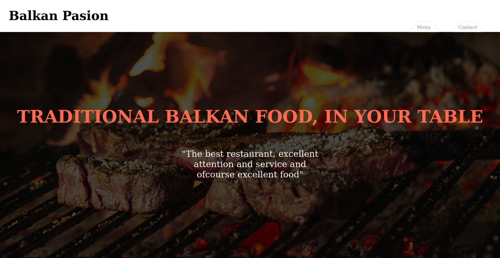

# Restaurant Balkan Pasion

The Restaurant project was built as the second project of the JavaScript module from Microvers. Here you can see the menu and the contact page using tabbed browsing.
One of the goals of this project is to work with webpack

##  :hammer: Built with:

- Html
- Scss
- JavaScript
- Webpack

##  :red_circle: Live Demo:

[Live demo](https://ricardomonte.github.io/restaurant-page/)

##  :construction_worker: Getting Started

To get a local copy up and running follow these simple steps:

- Go to the main page.
- Press the "Code" button and get the repo link.
- Clone it using git command "git clone".

## :bust_in_silhouette: Author

- Github: [@ricardomonte](https://github.com/ricardomonte)
- Twitter: [@ramnkco](https://twitter.com/ramnkco)
- LinkedIn: [Ricardo Montenegro](https://www.linkedin.com/in/ricantomontenegro/)

## :raised_hand: :raised_hand: Contributions

Contributions, issues and feature requests are welcome!

Feel free to check the [issues here](https://github.com/ricardomonte/Capstone-Project/issues).

## Show your support

Give a :star: if you like this project!.

##  :grey_exclamation: Acknowlegment

- To [Microverse](https://www.microverse.org/)
- Mentor.
- Stand up team

##  :memo: License

This project is [MIT](LICENSE) licensed.